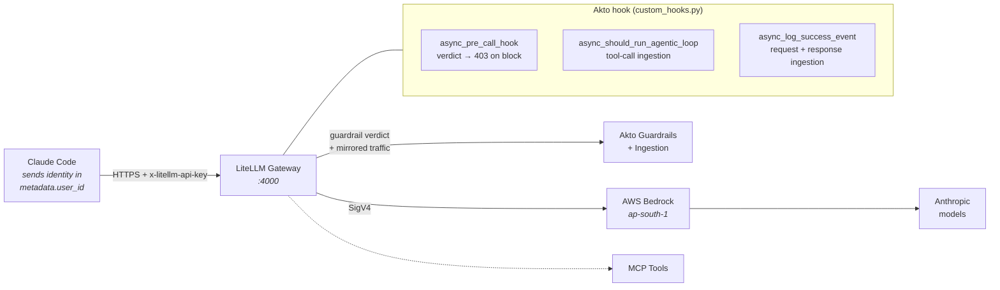

# Akto × LiteLLM

Reference setup for putting **Akto AI Guardrails** in front of LLM traffic with
**LiteLLM** as the gateway, including coding-agent traffic (Claude Code) routed
through to **AWS Bedrock**.

- Claude Code → LiteLLM → Bedrock → Anthropic
- Akto hook attached to LiteLLM for guardrails + traffic ingestion
- Layered enforcement: **Bedrock** owns toxicity/PII, **Akto** owns prompt injection
- User/agent identity forwarded to Akto as queryable tags

---

## Architecture



Per request the gateway makes **two** guardrail-relevant calls:

| Call | Query | Purpose |
|---|---|---|
| verdict | `?guardrails=true` | allow/block decision, **before** the model is called |
| ingestion | `?ingest_data=true` | full request + response recorded in Akto |

The verdict call is deliberately narrowed (see [Guardrails with coding agents](#guardrails-with-coding-agents)); **ingestion always carries the complete payload**.

---

## Quick start

```bash
git clone https://github.com/akto-api-security/akto-litellm
cd akto-litellm

# 1. Fetch the Akto connector hook (not vendored here - always take upstream)
curl -O https://raw.githubusercontent.com/akto-api-security/akto/master/apps/mcp-endpoint-shield/litellm/custom_hooks.py

# 2. Configure
cp .env.example .env
$EDITOR .env

# 3. Run
docker compose up -d

# 4. Verify the hook loaded
docker compose logs litellm | grep GuardrailsHandler
# GuardrailsHandler initialized | sync_mode=True
```

Point a client at it:

```bash
export ANTHROPIC_BASE_URL="https://your-gateway.example.com"
export ANTHROPIC_CUSTOM_HEADERS="x-litellm-api-key: Bearer $LITELLM_MASTER_KEY"
export ANTHROPIC_MODEL="bedrock-claude-sonnet-4-5"
export ANTHROPIC_DEFAULT_HAIKU_MODEL="bedrock-claude-haiku-4-5"
unset ANTHROPIC_AUTH_TOKEN ANTHROPIC_API_KEY   # see note below
claude
```

> **Leave `ANTHROPIC_AUTH_TOKEN` and `ANTHROPIC_API_KEY` unset.** `ANTHROPIC_CUSTOM_HEADERS`
> authenticates the *gateway* hop. Setting either variable overwrites the client's
> own `Authorization` header, which matters if you use LiteLLM's
> `forward_client_headers_to_llm_api` to reach Anthropic directly.

---

## Configuration

### `config.yaml`

| Block | Source |
|---|---|
| `litellm_settings.callbacks` | Akto docs — *Update LiteLLM Configuration* (verbatim) |
| `guardrails` (bedrock) | LiteLLM docs — *Bedrock Guardrails* |
| `general_settings.master_key` | LiteLLM docs — proxy config |
| `model_list` (bedrock) | LiteLLM docs — Bedrock provider |

The Akto connector needs exactly one line to activate:

```yaml
litellm_settings:
  callbacks: [custom_hooks.proxy_handler_instance]
```

### Bedrock models

`ap-south-1` has no regional Anthropic capacity for current models, so the
config uses **cross-region inference profiles**:

```yaml
- model_name: bedrock-claude-sonnet-4-5
  litellm_params:
    model: bedrock/global.anthropic.claude-sonnet-4-5-20250929-v1:0
    aws_region_name: os.environ/AWS_REGION_NAME
```

Confirm access before wiring a model in:

```bash
aws bedrock-runtime converse --region ap-south-1 \
  --model-id global.anthropic.claude-sonnet-4-5-20250929-v1:0 \
  --messages '[{"role":"user","content":[{"text":"ping"}]}]' \
  --inference-config '{"maxTokens":16}'
```

### Environment

See [`.env.example`](.env.example). Two defaults differ from the Akto docs and both are deliberate:

- **`TIMEOUT=30`** (docs say 5). Guardrail latency scales with payload size and crosses 5s around 200 KB. The `httpx` timeout raises an exception whose `str()` is empty, so the connector logged a blank line and **silently dropped the event**. 30s eliminates it.
- **`SYNC_MODE`** — `true` enforces, `false` observes. Note that `false` cannot be narrowed (that path validates and ingests in a single call), so its verdicts are unreliable for agent traffic. Use `true` for enforcement.

---

## Layered guardrails

Two independent layers, each owning a distinct class of risk so every block is
attributable to one owner:

| Risk | Owner | Response |
|---|---|---|
| Toxicity (hate/violence/sexual/insults/misconduct) | **AWS Bedrock** | `400 Violated guardrail policy` |
| PII (SSN, credit card) | **AWS Bedrock** | `400` with the triggering assessment |
| Prompt injection | **Akto** | `403 Blocked by Akto Guardrails` |
| Benign | — | `200` |

The Bedrock guardrail sets **`PROMPT_ATTACK = NONE`** on purpose, so it never
competes with Akto on injection.

### Two Bedrock policy choices

`EMAIL = BLOCK` is *correct* enforcement, but coding agents inject the operator's
email into a `<system-reminder>` on **every** request, so it rejects 100% of
benign agent traffic. Two usable options:

| Guardrail | EMAIL | Effect |
|---|---|---|
| strict | `BLOCK` | strongest; agent traffic unusable — demo via a plain API client |
| agent-friendly | `ANONYMIZE` | Bedrock masks the email before the model sees it; SSN/card still `BLOCK` |

Switch by changing `guardrailIdentifier` / `guardrailVersion` in `config.yaml`.

### Session behaviour

Bedrock re-reads the whole conversation by default, so one PII message poisons
every later turn. Fixed with a documented flag:

```yaml
experimental_use_latest_role_message_only: true
```

This makes the Bedrock layer judge the same slice the Akto layer does — the
newest user turn — so the two stay symmetric.

---

## Passing user metadata

This is the mechanism the Akto hook reads to attribute traffic. **Three channels,
all landing in LiteLLM's `metadata` dict, which the hook turns into Akto tags.**

### 1. Automatic — the client's own identity

Claude Code populates the Anthropic `metadata.user_id` field on every request.
Nothing to configure:

```
client_account_uuid = 3623eb18-c6de-4621-8ea8-b8f58fb1053a
client_device_id    = ebb0e005ed1aaffa9ecdd2fc2f22c08b0037977e15110c79b61d6ee9...
client_session_id   = a11d32de-cdae-4e78-87cb-e578dfc19db1
client_user_agent   = claude-cli/2.1.252 (external, claude-vscode, agent-sdk/0.3.245)
```

### 2. Virtual keys — server-side identity, no client change

```bash
curl -X POST http://localhost:4000/key/generate \
  -H "Authorization: Bearer $LITELLM_MASTER_KEY" \
  -H "Content-Type: application/json" \
  -d '{
    "key_alias": "umesh-laptop",
    "user_id": "umesh@akto.io",
    "metadata": {
      "key_type": "application",
      "app_name": "claude-code-umesh",
      "user_email": "umesh@akto.io",
      "department": "engineering",
      "employee_id": "E-1042"
    }
  }'
```

Every key in `metadata` becomes an Akto tag. `key_alias` / `team_alias` also
drive the **collection name**, so each agent gets its own collection.

Collection resolution order: `metadata.agent_name` → `user_api_key_metadata`
(`app_name`, `app_slug`) when `key_type: application` → `key_alias` →
`team_alias` → host of `LITELLM_URL`.

### 3. Request headers — for JWT-derived or per-request identity

```bash
export ANTHROPIC_CUSTOM_HEADERS="x-litellm-api-key: Bearer $KEY
x-litellm-end-user-id: umesh@akto.io
x-litellm-tags: team-platform,claude-code
x-litellm-spend-logs-metadata: {\"jwt_sub\":\"auth0|abc123\",\"seat\":\"eng-42\"}"
```

`x-litellm-spend-logs-metadata` takes arbitrary JSON and each field is flattened
into its own tag — this is where decoded JWT claims belong.

### Result

A single Claude Code request, all three channels combined — **21 tags in Akto**:

```
app_name            = claude-code-umesh        caller_tags  = team-platform,claude-code
client_account_uuid = 3623eb18-c6de-...        client_device_id = ebb0e005ed1aaf...
client_session_id   = a11d32de-cdae-...        client_user_agent = claude-cli/2.1.252
department          = engineering              employee_id  = E-1042
end_user_id         = umesh@akto.io            jwt_sub      = auth0|abc123
key_type            = application              model        = global.anthropic...
seat                = eng-42                   session_id   = a11d32de-cdae-...
trace_id            = a11d32de-cdae-...        user_email   = umesh@akto.io
user_id             = umesh@akto.io            litellm_call_id = a12d3e07-...
call_type           = anthropic_messages       gen-ai / litellm
```

### Session & trace correlation

Session identity is also emitted as `x-akto-installer-*` request headers, the
same convention the other Akto connectors use, so traces index consistently:

```
x-akto-installer-akto_session_id  = <session id>
x-akto-installer-akto_message_id  = <litellm_call_id>
x-akto-installer-session_id / trace_id / litellm_call_id / user_agent
```

---

## Guardrails with coding agents

A coding agent's request is nothing like an app's. Measured on real Claude Code
traffic:

| | Size |
|---|---|
| full request | 86–120 KB |
| system prompt | ~18,000 chars |
| tool catalogue | ~130 KB |
| the user's actual prompt | **63 chars** |

Handing all of that to a guardrail buries the prompt. The same injection string
blocks reliably on its own and is allowed inside the full request. The connector
therefore narrows **the verdict call only**:

```
verdict payload : 120,139 B  ->  136–175 B
ingestion       : unchanged, full request
```

Two knobs control it — see `.env.example`:

- `VALIDATE_LAST_USER_MESSAGE_ONLY=true` — judge the newest user turn
- `STRIP_HARNESS_CONTEXT=true` — drop `<system-reminder>` scaffolding, which is
  harness context rather than user input

`QUARANTINE_BLOCKED_HISTORY=true` closes a related gap: a client that has a
message rejected keeps it locally and resends it as history, so blocked content
would still reach the model. The connector remembers what it blocked (per
session, in memory) and strips those turns before forwarding.

---

## Testing

```bash
./test-guardrails.sh 5      # 4-quadrant matrix, attributes each block by layer
```

```
case                   observed layer per run   | expectation
benign                 allowed allowed allowed  | allowed
toxic (hate)           BEDROCK BEDROCK BEDROCK  | BEDROCK
PII (email+SSN)        BEDROCK BEDROCK BEDROCK  | BEDROCK
prompt injection       AKTO    AKTO    AKTO     | AKTO
```

Bedrock blocks are `HTTP 400 Violated guardrail policy` with the triggering
assessment in the body; Akto blocks are `HTTP 403 Blocked by Akto Guardrails`.

Watch the decisions live:

```bash
docker compose logs -f litellm | grep -E \
  "Narrowed guardrail view|Blocked by Akto|Violated guardrail|Stripped .* quarantined"
```

---

## Known issues

| Issue | Status |
|---|---|
| Akto guardrail verdicts are not reproducible for byte-identical input | **open, server-side** |
| `policy_name` / `rule_violated` are empty on every Akto block; `Reason` is always `"Blocked by Akto"` — nothing is diagnosable | **open, server-side** |
| Akto injection coverage is narrow (1 of 8 tested phrasings blocked) | **open, server-side** |
| `SYNC_MODE=false` verdicts unreliable — that path validates and ingests in one call, so it cannot be narrowed | open |
| Quarantine state is in-memory (500 sessions × 50 turns, cleared on restart) — a multi-replica deployment needs shared state | open |
| Akto malicious-session detection can block later benign turns in a session that contained a violation | by design; framing matters for demos |

---

## Repository layout

```
config.yaml            LiteLLM + Akto + Bedrock guardrail configuration
docker-compose.yml     gateway + postgres
.env.example           every setting, documented
up.sh                  idempotent bring-up
test-guardrails.sh     layered guardrail matrix
claude-via-bedrock.sh  point Claude Code at the gateway (Bedrock backend)
claude-as-agent.sh     same, via a virtual key with key_alias
docs/claude-code-vs-litellm.md   Akto hook comparison: telemetry & control
```

`custom_hooks.py` is **not vendored** — fetch it from
[akto-api-security/akto](https://github.com/akto-api-security/akto/tree/master/apps/mcp-endpoint-shield/litellm)
so you always run the current connector.

## Further reading

- [Akto hooks: Claude Code vs LiteLLM](docs/claude-code-vs-litellm.md)
- [Akto LiteLLM connector docs](https://docs.akto.io)
- [LiteLLM proxy docs](https://docs.litellm.ai/docs/proxy/docker_quick_start)
